# RAG with IBM Db2 & Local LLMs

A Retrieval-Augmented Generation (RAG) pipeline that answers questions by grounding responses in web content stored in **IBM Db2's vector database**. This project leverages **Db2's native vector search capabilities** and the **official LangChain-Db2 connector** for seamless integration with local LLM models.

## 🎓 Overview

This project combines several technologies to create an intelligent Q&A system that runs entirely on CPU:

**The Problem:** Large Language Models can hallucinate or provide outdated information.

**The Solution:** RAG grounds LLM responses in specific, retrieved documents.

### Why IBM Db2?

This project showcases **IBM Db2's powerful vector capabilities**:
- 🎯 **Native Vector Support**: Db2's built-in vector data type and similarity search
- 🔗 **Db2 LangChain Connector**: Seamless integration via `langchain-db2` package
- 🏢 **Enterprise-Grade**: Production-ready vector storage with ACID compliance

### Pipeline Architecture

```mermaid
graph TD
    A[🌐 Web Article URL] --> B[📥 Trafilatura<br/>Extract Content]
    B --> C[✂️ SpaCy Chunker<br/>200 words, 50 overlap]
    C --> D[🧠 Local Embedding Model<br/>Granite 30M]
    D --> E[💾 IBM Db2 Vector Store<br/>LangChain Connector<br/>EUCLIDEAN distance]
    
    F[❓ User Question] --> G[🔍 Embed Question<br/>Same model]
    G --> H[🎯 Db2 Similarity Search<br/>Top 3 chunks]
    E --> H
    
    H --> I[📝 Build Prompt<br/>Context + Question]
    I --> J[🤖 Local LLM<br/>Qwen2.5 7B]
    J --> K[✅ Grounded Answer<br/>+ Source Chunks]
    
    style A fill:#e1f5ff
    style F fill:#fff4e1
    style K fill:#e8f5e9
    style E fill:#f3e5f5
```



Key Benefits:
▸ Factual answers backed by source documents
▸ Runs entirely on CPU (no GPU required)
▸ Works offline with local models (no API costs)
▸ Enterprise vector storage with IBM Db2's native vector features
▸ Seamless LangChain integration via official Db2 connector
▸ Full control over embedding and generation models

---

## 📦 Prerequisites

- Python 3.13+
- IBM Db2 12.1.2+
- ~8GB disk space for models
- 8GB+ RAM recommended
- CPU-only (no GPU required)
- `uv` package manager ([install here](https://github.com/astral-sh/uv))

---

## ⚙️ Quick Setup

### 1. Clone Repository

```bash
git clone https://github.com/shaikhq/db2-langchain-rag-local.git
cd db2-langchain-rag-local
```

Or download and extract the ZIP file.

### 2. Environment & Dependencies

```bash
# Create virtual environment with uv
uv venv --python $(which python3.13)

# Install dependencies
uv pip install -r requirements.txt

# Install spaCy language model
uv run python -m spacy download en_core_web_sm
```

### 3. Download Models

**Embedding Model** (30M parameters, ~17MB):
```bash
wget -O granite-embedding-30m-english-Q6_K.gguf \
  https://huggingface.co/lmstudio-community/granite-embedding-30m-english-GGUF/resolve/main/granite-embedding-30m-english-Q6_K.gguf
```

**LLM Model** (7B parameters, ~4.4GB):
```bash
# Option 1: From bartowski repo (recommended)
wget https://huggingface.co/bartowski/Qwen2.5-7B-Instruct-GGUF/resolve/main/Qwen2.5-7B-Instruct-Q4_K_M.gguf

# Option 2: From paultimothymooney repo (alternative)
wget https://huggingface.co/paultimothymooney/Qwen2.5-7B-Instruct-Q4_K_M-GGUF/resolve/main/qwen2.5-7b-instruct-q4_k_m.gguf
```

**Note:** Both LLM options are the same model with different filenames. Choose one.

### 4. Configure Environment

Create `.env` in project root:

```bash
# IBM Db2 Configuration
DB_NAME=your_database
DB_HOST=hostname.example.com
DB_PORT=50000
DB_PROTOCOL=TCPIP
DB_USER=your_username
DB_PASSWORD=your_password

# Model Paths (MUST be absolute paths)
LLM_PATH=/full/path/to/Qwen2.5-7B-Instruct-Q4_K_M.gguf
EMBEDDING_MODEL_PATH=/full/path/to/granite-embedding-30m-english-Q6_K.gguf
```

**Example paths:**
```bash
# If models are in project directory
LLM_PATH=/home/user/rag-project/Qwen2.5-7B-Instruct-Q4_K_M.gguf
EMBEDDING_MODEL_PATH=/home/user/rag-project/granite-embedding-30m-english-Q6_K.gguf

# Get absolute path of current directory
pwd  # Use this output as base for your paths
```

**⚠️ Important:** 
- Use `pwd` to get your current directory
- Paths must be absolute (start with `/`)
- Never commit `.env` to git

---

## 🔍 Usage

### Launch Jupyter

```bash
jupyter notebook rag-basic.ipynb
```

### Ask Questions

The notebook creates a `rag` chain that you can query:

```python
# Ask a question
result = rag.invoke('How to build a linear regression model in Db2?')

# View answer
print(result['result'])

# View retrieved source chunks
for i, doc in enumerate(result['source_documents']):
    print(f"\n--- Chunk {i+1} ---")
    print(doc.page_content)
```

**What happens under the hood:**
1. Question is embedded using local embedding model
2. Db2 finds 3 most similar chunks via vector search
3. Chunks are injected into prompt as context
4. Local LLM generates answer grounded in context
5. Returns both answer and source documents

---

## 🧩 Pipeline Components

| Step | Component | Configuration |
|------|-----------|---------------|
| **1. Web Scraping** | `trafilatura` | Fetches article from URL |
| **2. Text Chunking** | `spaCy` + custom chunker | 200 words/chunk, 50-word overlap |
| **3. Embeddings** | `LlamaCppEmbeddings` | Granite 30M model, CPU mode |
| **4. Vector Store** | `DB2VS` | EUCLIDEAN distance strategy |
| **5. Retrieval** | `as_retriever()` | Top-3 similarity search |
| **6. LLM** | `LlamaCpp` | Qwen2.5-7B, CPU mode |
| **7. RAG Chain** | `RetrievalQA` | Combines retrieval + generation |

---

## 🛠️ Key Configuration

```python
# Text Chunking
overlapping_sentence_chunker(
    text=article,
    max_words=200,        # Chunk size
    overlap_words=50      # Overlap between chunks
)

# Embedding Model
LlamaCppEmbeddings(
    model_path=EMBEDDING_MODEL_PATH,
    n_ctx=256,            # Context window
    n_batch=1,
    n_gpu_layers=0        # CPU-only for embeddings
)

# Vector Store
DB2VS.from_texts(
    texts=chunks,
    embedding=embeddings,
    client=connection,
    table_name="Documents_EUCLIDEAN",
    distance_strategy=DistanceStrategy.EUCLIDEAN_DISTANCE
)

# LLM (CPU-only configuration)
LlamaCpp(
    model_path=LLM_PATH,
    n_gpu_layers=0,       # CPU-only mode
    max_tokens=750,       # Max response length
    n_ctx=4096,          # Context window
    temperature=0.3,     # Low = factual, High = creative
    top_p=0.9,
    top_k=40,
    repeat_penalty=1.1
)

# Retriever
vectorstore.as_retriever(
    search_type="similarity",
    search_kwargs={"k": 3}    # Return top 3 chunks
)
```

---

## 💭 Performance Tips (CPU Optimization)

- **Reduce Context Window**: Lower `n_ctx=2048` for faster processing
- **Limit Response Length**: Set `max_tokens=512` for quicker responses
- **Smaller Model**: Use 3B or 1B models for better CPU performance
- **Fewer Chunks**: Lower `k=2` to retrieve fewer documents
- **Better Quantization**: Q4_K_M offers best speed/quality balance on CPU
- **Batch Processing**: Process multiple questions in sequence to reuse loaded model

---

## 🖥️ Optional: VS Code + Jupyter Setup

If using VS Code with Jupyter:

```bash
# Register kernel
uv run python -m ipykernel install --user \
  --name=python313-local \
  --display-name "Python 3.13 (Local .venv)"
```

**In VS Code:**
1. `Cmd+Shift+P` (Mac) or `Ctrl+Shift+P` (Win/Linux)
2. Type: **Python: Select Interpreter**
3. Press `Cmd+Shift+.` to show hidden `.venv` folder
4. Select `.venv/bin/python` (or `.venv\Scripts\python.exe` on Windows)
5. `Cmd+Shift+P` → **Jupyter: Select Interpreter to Start Jupyter Server**
6. Choose the same `.venv` Python

**If kernel doesn't appear:**
- Select a different kernel temporarily
- Switch back to `.venv` kernel
- Run: `Developer: Reload Window`

---

## 🗂️ Tech Stack

| Component | Purpose |
|-----------|---------|
| **LangChain** | RAG framework & orchestration |
| **IBM Db2** | Vector storage & similarity search |
| **llama.cpp** | Efficient local model inference |
| **spaCy** | Sentence segmentation for chunking |
| **trafilatura** | Web content extraction |
| **python-dotenv** | Environment variable management |
| **uv** | Fast Python package management |

---

## 🔐 Security Notes

- ⚠️ Add `.env` to `.gitignore` - never commit credentials
- 🔒 Use read-only Db2 credentials if possible
- 🛡️ Validate/sanitize URLs before scraping
- 🚫 Don't expose model paths in logs or errors
