# RAG with IBM Db2 & Local LLMs

A Retrieval-Augmented Generation (RAG) pipeline that answers questions by grounding responses in web content stored in **IBM Db2's vector database**. This project leverages **Db2's native vector search capabilities** and the **official LangChain-Db2 connector** for seamless integration with local LLM models.

## 🎯 Overview

This project combines several technologies to create an intelligent Q&A system that runs entirely on CPU:

**The Problem:** Large Language Models can hallucinate or provide outdated information.

**The Solution:** RAG grounds LLM responses in specific, retrieved documents.

### Why IBM Db2?

This project showcases **IBM Db2's powerful vector capabilities**:
- 🎯 **Native Vector Support**: Db2's built-in vector data type and similarity search
- 🔗 **Db2 LangChain Connector**: Seamless integration via `langchain-db2` package
- 🏢 **Enterprise-Grade**: Production-ready vector storage with ACID compliance

### Pipeline Architecture

```mermaid
graph TD
    A[🌐 Web Article URL] --> B[📥 Trafilatura<br/>Extract Content]
    B --> C[✂️ SpaCy Chunker<br/>200 words, 50 overlap]
    C --> D[🧠 Local Embedding Model<br/>Granite 30M]
    D --> E[💾 IBM Db2 Vector Store<br/>LangChain Connector<br/>EUCLIDEAN distance]
    
    F[❓ User Question] --> G[🔍 Embed Question<br/>Same model]
    G --> H[🎯 Db2 Similarity Search<br/>Top 3 chunks]
    E --> H
    
    H --> I[📝 Build Prompt<br/>Context + Question]
    I --> J[🤖 Local LLM<br/>Qwen2.5 3B]
    J --> K[✅ Grounded Answer<br/>+ Source Chunks]
    
    style A fill:#e1f5ff
    style F fill:#fff4e1
    style K fill:#e8f5e9
    style E fill:#f3e5f5
```


**Key Benefits:**

▸ Factual answers backed by source documents  
▸ Runs entirely on CPU (no GPU required)  
▸ Works offline with local models (no API costs)  
▸ **Enterprise vector storage with IBM Db2's native vector features**  
▸ **Seamless LangChain integration via official Db2 connector**  
▸ Full control over embedding and generation models

---

## 📦 Prerequisites

- Python 3.13+
- IBM Db2 12.1.2+
- ~4GB disk space for models
- 8GB+ RAM (32+ cores recommended for best performance)
- CPU-only (no GPU required)
- `uv` package manager ([install here](https://github.com/astral-sh/uv))

---

## ⚙️ Quick Setup

### 1. Clone Repository
```bash
git clone https://github.com/shaikhq/db2-langchain-rag-local.git
cd db2-langchain-rag-local
```

Or download and extract the ZIP file.

### 2. Environment & Dependencies
```bash
# Create virtual environment
uv venv --python $(which python3.13)

# Install dependencies from requirements.txt
uv pip install -r requirements.txt

# Install pip (required for spacy model downloads)
uv pip install pip

# Download spaCy language model
uv run python -m spacy download en_core_web_sm
```

### 3. Download Models

Navigate to the folder where you want to download the models:
```bash
cd /path/to/models  # e.g., ~/models or /storage/models
```

**Embedding Model** (30M parameters, ~17MB):
```bash
wget -O granite-embedding-30m-english-Q6_K.gguf \
  https://huggingface.co/lmstudio-community/granite-embedding-30m-english-GGUF/resolve/main/granite-embedding-30m-english-Q6_K.gguf
```

**LLM Model** (3B parameters, ~2GB):
```bash
wget -O qwen2.5-3b-instruct-q4_k_m.gguf \
  https://huggingface.co/Qwen/Qwen2.5-3B-Instruct-GGUF/resolve/main/qwen2.5-3b-instruct-q4_k_m.gguf
```

### 4. Configure Environment

Create `.env` file in project root:
```bash
touch .env
```

Add the following to `.env` (replace with your values):
```bash
# IBM Db2 Configuration
DB_NAME=your_database
DB_HOST=hostname.example.com
DB_PORT=50000
DB_PROTOCOL=TCPIP
DB_USER=your_username
DB_PASSWORD=your_password

# Model Paths (MUST be absolute paths)
LLM_PATH=/absolute/path/to/qwen2.5-3b-instruct-q4_k_m.gguf
EMBEDDING_MODEL_PATH=/absolute/path/to/granite-embedding-30m-english-Q6_K.gguf
```

**Example:**
```bash
# Get your current directory
pwd

# Use the output to construct absolute paths
LLM_PATH=/home/user/models/qwen2.5-3b-instruct-q4_k_m.gguf
EMBEDDING_MODEL_PATH=/home/user/models/granite-embedding-30m-english-Q6_K.gguf
```

**⚠️ Important:** 
- Use absolute paths (starting with `/`)
- Never commit `.env` to git (it's in `.gitignore`)
- Verify paths exist: `ls -la $LLM_PATH`

---

## 🚀 Usage

### Launch Jupyter
```bash
# Make sure your virtual environment is activated
source .venv/bin/activate  # or .venv\Scripts\activate on Windows

# Start Jupyter
jupyter notebook rag-basic.ipynb
```

### Ask Questions

The notebook creates a `rag` chain that you can query:
```python
# Ask a question
result = rag.invoke('How to build a linear regression model in Db2?')

# Display results (formatted)
from IPython.display import display, Markdown

markdown_output = f"""
## 💡 Answer

{result['result']}

---

## 📚 Retrieved Context
"""

for i, doc in enumerate(result['source_documents'], 1):
    markdown_output += f"\n**📄 Chunk {i}**\n\n{doc.page_content}\n\n---\n"

display(Markdown(markdown_output))
```

**What happens under the hood:**
1. Question is embedded using local embedding model
2. Db2 finds 3 most similar chunks via vector search
3. Chunks are injected into prompt as context
4. Local LLM generates answer grounded in context
5. Returns both answer and source documents

---

## 🧩 Pipeline Components

| Step | Component | Configuration |
|------|-----------|---------------|
| **1. Web Scraping** | `trafilatura` | Fetches article from URL |
| **2. Text Chunking** | `spaCy` + custom chunker | 200 words/chunk, 50-word overlap |
| **3. Embeddings** | `LlamaCppEmbeddings` | Granite 30M, 16 threads |
| **4. Vector Store** | `DB2VS` | EUCLIDEAN distance strategy |
| **5. Retrieval** | `as_retriever()` | Top-3 similarity search |
| **6. LLM** | `LlamaCpp` | Qwen2.5-3B, 30 threads, CPU-only |
| **7. RAG Chain** | `RetrievalQA` | Combines retrieval + generation |

---

## 🛠️ Key Configuration

### Text Chunking
```python
overlapping_sentence_chunker(
    text=article,
    max_words=200,        # Chunk size
    overlap_words=50      # Overlap between chunks
)
```

### Embedding Model (with CPU optimization)
```python
embeddings = LlamaCppEmbeddings(
    model_path=EMBEDDING_MODEL_PATH,
    n_ctx=2048,           # Context window
    n_threads=16,         # Use half your CPU cores
    n_batch=8,            # Small batch for embeddings
    n_gpu_layers=0        # CPU-only
)
```

### Vector Store
```python
vectorstore = DB2VS.from_texts(
    texts=chunks,
    embedding=embeddings,
    client=connection,
    table_name="Documents_EUCLIDEAN",
    distance_strategy=DistanceStrategy.EUCLIDEAN_DISTANCE
)
```

### LLM (CPU-optimized configuration)
```python
llm = LlamaCpp(
    model_path=LLM_PATH,
    n_gpu_layers=0,       # CPU-only mode
    n_threads=30,         # Use most CPU cores (leave 2 for system)
    n_batch=512,          # Batch processing
    max_tokens=250,       # Max response length
    n_ctx=2048,          # Context window
    temperature=0.3,     # Low = factual, High = creative
    top_p=0.9,
    top_k=40,
    repeat_penalty=1.1,
    verbose=False        # Suppress debug output
)
```

### Retriever
```python
retriever = vectorstore.as_retriever(
    search_kwargs={"k": 3}    # Return top 3 chunks
)
```

---

## 💭 Performance Tips (CPU Optimization)

**For 32 CPU cores (as tested):**
- Use `n_threads=30` for LLM (leave 2 cores for system)
- Use `n_threads=16` for embeddings
- Expected speed: ~10-20 tokens/sec with 3B model
- Response time: ~30-60 seconds for 250 tokens

**General optimizations:**
- **Smaller Context**: Lower `n_ctx=1024` if prompts are short
- **Shorter Responses**: Set `max_tokens=150` for faster replies
- **Smaller Model**: Try 1.5B models for even faster inference
- **Fewer Chunks**: Set `k=2` to retrieve less context
- **Better Quantization**: Q4_K_M offers best speed/quality balance
- **Increase Threads**: Match `n_threads` to your CPU core count (`nproc`)

**Check your CPU cores:**
```bash
nproc  # Linux/Mac
echo %NUMBER_OF_PROCESSORS%  # Windows
```

---

## 🖥️ Optional: VS Code + Jupyter Setup

If using VS Code with Jupyter:

1. **Select Interpreter:**
   - `Cmd+Shift+P` (Mac) or `Ctrl+Shift+P` (Win/Linux)
   - Type: **Python: Select Interpreter**
   - Select `.venv/bin/python`

2. **Select Jupyter Kernel:**
   - `Cmd+Shift+P` → **Jupyter: Select Interpreter to Start Jupyter Server**
   - Choose the same `.venv` Python

3. **If kernel doesn't appear:**
   - Run: `Developer: Reload Window`
   - Or restart VS Code

---

## 🗂️ Tech Stack

| Component | Purpose |
|-----------|---------|
| **LangChain** | RAG framework & orchestration |
| **IBM Db2** | Vector storage & similarity search |
| **llama.cpp** | Efficient local model inference |
| **spaCy** | Sentence segmentation for chunking |
| **trafilatura** | Web content extraction |
| **python-dotenv** | Environment variable management |
| **uv** | Fast Python package management |

---

## 📋 Project Structure

```
db2-langchain-rag-local/
├── rag-basic.ipynb          # Main notebook
├── requirements.txt         # Python dependencies (pinned versions)
├── .env                     # Configuration (DO NOT COMMIT)
├── .gitignore              # Git ignore rules
└── README.md               # This file
```

---

## 🔐 Security Notes

- ⚠️ Never commit `.env` - it's in `.gitignore`
- 🔒 Use read-only Db2 credentials when possible
- 🛡️ Validate/sanitize URLs before scraping
- 🚫 Don't expose model paths in logs or errors
- 🔑 Rotate credentials regularly

---

## 📧 Contact

**Shaikh Quader** - [LinkedIn](https://www.linkedin.com/in/shaikhquader/)

---

## 🙏 Acknowledgments

- IBM Db2 team for native vector support and the Db2 connector
- llama.cpp for efficient CPU inference
- Qwen and IBM Granite model teams
